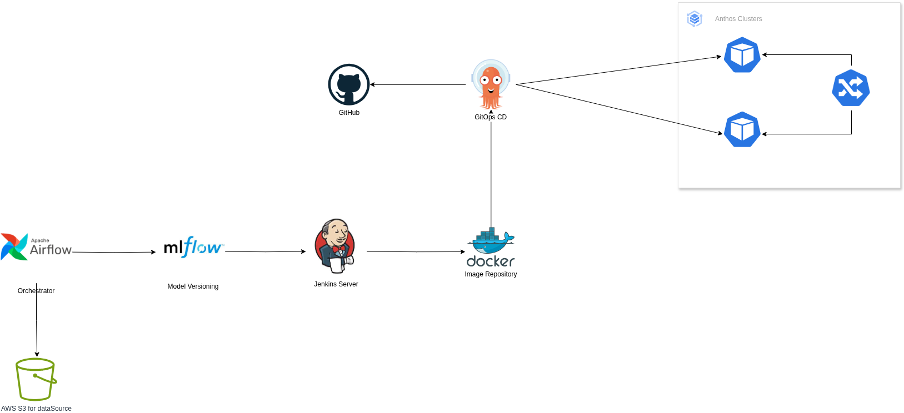

# ML Project: Continuous Training, Versioning, and GitOps Deployment Pipeline

## 📌 Project Overview

This project implements a robust MLOps pipeline that automates data ingestion, model training, versioning, containerization, and continuous deployment. It leverages CI/CD and GitOps practices to streamline the entire lifecycle of a machine learning model — from development to production — in a reproducible and scalable manner.

---

## 🔧 Architecture Overview


> Replace the image above with the final exported PNG/JPG of your architecture diagram if different.

---

## 🧩 Components & Workflow

### 1. **Data Ingestion & Orchestration (Apache Airflow + S3)**

- **Tool**: [Apache Airflow](https://airflow.apache.org/)
- **Function**: Orchestrates the entire ML pipeline.
- **Data Source**: AWS S3 serves as the source of raw and processed data.
- **Responsibilities**:
  - Schedules recurring training tasks.
  - Validates and preprocesses data.
  - Pushes metadata for tracking downstream.

---

### 2. **Model Training & Versioning (MLflow)**

- **Tool**: [MLflow](https://mlflow.org/)
- **Function**: Tracks experiments and manages model versioning.
- **Responsibilities**:
  - Logs training metrics and parameters.
  - Stores models with associated metadata (data hash, evaluation scores).
  - Registers models for deployment and rollback.

---

### 3. **CI/CD Integration (Jenkins Server)**

- **Tool**: [Jenkins](https://www.jenkins.io/)
- **Function**: Builds and automates CI pipelines.
- **Responsibilities**:
  - Pulls latest model and codebase.
  - Builds Docker images for serving the model.
  - Pushes image to Docker registry.
  - Triggers ArgoCD (GitOps) for deployment.

---

### 4. **Containerization (Docker)**

- **Tool**: [Docker](https://www.docker.com/)
- **Function**: Encapsulates the ML model and inference API into lightweight containers.
- **Responsibilities**:
  - Ensures portability and reproducibility.
  - Version-controlled Docker images.

---

### 5. **GitOps Continuous Delivery (ArgoCD + GitHub)**

- **Tool**: [ArgoCD](https://argo-cd.readthedocs.io/)
- **Function**: GitOps-based CD system to monitor GitHub for deployment changes.
- **Responsibilities**:
  - Deploys the latest containerized model to Kubernetes clusters (Anthos).
  - Enables rollback to previous versions if performance degrades.
  - Syncs Git repo with cluster state.

---

### 6. **Deployment Environment (Anthos Clusters)**

- **Tool**: Google Anthos (Kubernetes)
- **Function**: Manages distributed hybrid cloud Kubernetes clusters.
- **Responsibilities**:
  - Hosts scalable inference APIs.
  - Facilitates A/B Testing and automated rollbacks.
  - Routes traffic using built-in service mesh (e.g., Istio or similar).

---

## ✅ Processes To be Implemented in Phase 2

| Requirement                                      | Implemented Component                            |
|--------------------------------------------------|--------------------------------------------------|
| Automated model training                         | Airflow → MLflow → Jenkins                       |
| Model versioning                                 | MLflow + S3 + metadata tagging                   |
| CI/CD pipeline setup                             | Jenkins + Docker + ArgoCD                        |
| Reproducibility and traceability                 | MLflow experiment tracking                       |
| Scalable deployment to production environment    | GitOps (ArgoCD) → Anthos Kubernetes Clusters     |
| Automated rollback readiness (in progress)       | GitOps/CD + model version tagging via MLflow     |
| Source control integration                       | GitHub                                           |

---

## 🔄 Flow Summary

```
Data → [Airflow] → [MLflow] → [Jenkins] → [Docker] → [ArgoCD + GitHub] → [Anthos Clusters]
```

- **Airflow** triggers pipelines and fetches data from **S3**.
- Processed data is used to train models with metrics tracked via **MLflow**.
- **Jenkins** builds and tests Dockerized versions of the models.
- Images are pushed to a **Docker Registry**.
- **ArgoCD** detects changes and deploys the container to **Anthos Clusters**.

---

## 🚀 Next Steps (Phase 2+)

- **Implement A/B Testing Infrastructure** using a service mesh or custom routing logic.
- **Add rollback mechanisms** based on real-time performance thresholds.
- **Integrate a scalable inference API** using FastAPI or Flask.
- **Enhance monitoring** using Prometheus + Grafana or Sentry.

---

## 📁 Suggested Project Structure

```
ml_pipeline_project/
├── data/
├── models/
├── pipelines/
│   ├── train_model_dag.py
│   └── rollback.py
├── inference/
│   ├── inference_api.py
│   └── Dockerfile
├── scripts/
│   ├── train.py
│   ├── evaluate.py
│   ├── compare_ab.py
│   └── track_experiments.py
├── tests/
├── configs/
├── .github/workflows/
├── README.md
└── requirements.txt
```

---

